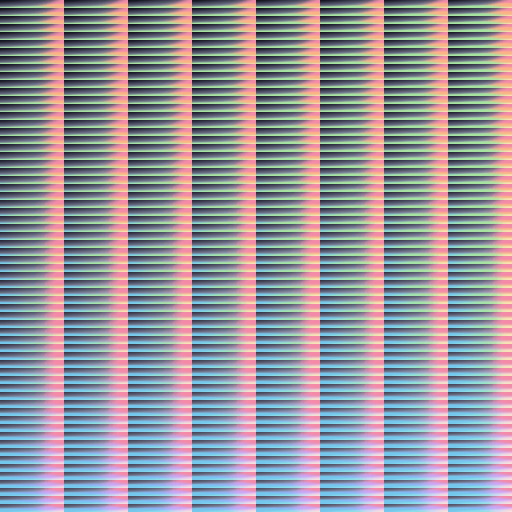

<header>
    <h1 align="center">lutgen-rs</h1>
    <p align="center">
        <a href="https://crates.io/crates/lutgen"></a>
        <a href="./LICENSE"></a>
        <a href="https://github.com/ozwaldorf/lutgen-rs/actions/workflows/rust.yml"></a>
        <a href="https://github.com/ozwaldorf/lutgen-rs/actions/workflows/publish.yml"></a>
    </p>
    <p align="center">
        A blazingly fast interpolated LUT generator using gaussian distribution for arbitrary and popular color palettes.
    </p>
</header>

---

## Example

<details>
    <summary>Catppuccin Mocha Hald CLUT</summary>
    
</details>
<details>
    <summary>Original Image</summary>
    
</details>
<details>
    <summary>Corrected Image</summary>
    
</details>

## Usage

### CLI

Install

```bash
cargo install lutgen
```

Helptext

```text
A blazingly fast interpolated LUT generator using gaussian distribution for arbitrary and popular color palettes.

Usage: lutgen [OPTIONS] [CUSTOM_COLORS]... [COMMAND]

Commands:
  apply
          Correct an image using a hald clut, either generating it, or loading it externally
  help
          Print this message or the help of the given subcommand(s)

Arguments:
  [CUSTOM_COLORS]...
          Custom hexidecimal colors to add to the palette. If `-p` is not used to specify a base palette, at least 1 color is required

Options:
  -o, --output <OUTPUT>
          Path to write output to

  -p <PALETTE>
          Predefined popular color palettes. Use `lutgen -p` to view all options. Compatible with custom colors

  -a <ALGORITHM>
          Remapping algorithm to generate the LUT with
          
          [default: gaussian-v1]

          Possible values:
          - gaussian-v1:      Fastest algorithm for gaussian interpolated remapping
          - gaussian-v0:      Original algorithm for gaussian interpolated remapping
          - nearest-neighbor: Non-interpolated algorithm that remaps to the nearest neighbor

  -l, --level <LEVEL>
          Hald level (ex: 8 = 512x512 image)
          
          [default: 8]

  -m, --mean <MEAN>
          Mean for gaussian distribution
          
          [default: 0]

  -s, --std-dev <STD_DEV>
          Standard deviation for gaussian distribution
          
          [default: 20]

  -i, --iterations <ITERATIONS>
          Number of gaussian samples for each color to average together
          
          [default: 512]

  -h, --help
          Print help (see a summary with '-h')

  -V, --version
          Print version
```

#### Examples

Generating a LUT

```bash
lutgen -p catppuccin-mocha -o mocha_lut.png
```

Correcting an image with an ephimeral LUT

```bash
lutgen -p catppuccin-mocha correct assets/simon-berger-unsplash.jpg -o mocha_version.png
```

Correcting an image with a prerendered LUT

```bash
lutgen correct --hald-clut mocha_lut.png assets/simon-berger-unsplash.jpg
```

Correcting Videos (using ffmpeg):

```bash
ffmpeg -i input.mkv -i hald_clut.png -filter_complex '[0][1] haldclut' output.mp4
```

### Library

> By default, the `bin` feature and dependencies are enabled.
> When used as a library, it's recommended to use `default-features = false` to minimalize the dependency tree and build time.

Generating a LUT (simple):

```rust
use exoquant::SimpleColorSpace;
use lutgen::{
    interpolated_remap::{
        GaussianV0Params, GaussianV0Remapper, GaussianV1Params, GaussianV1Remapper
    },
    generate_lut,
};

// Setup the palette and colorspace for nearest neighbor lookups.
let palette = vec![
    [255, 0, 0],
    [0, 255, 0],
    [0, 0, 255],
];
let colorspace = SimpleColorSpace::default();

// Generate a lut using the slower v0 algorithm
let params = GaussianV0Params {
    mean: 4.0,
    std_dev: 20.0,
    iterations: 512,
    seed: 80085,
    colorspace: SimpleColorSpace::default(),
};
let output = generate_lut::<GaussianV0Remapper<_>>(8, &palette, params);
// output.save("v0_hald_8.png").unwrap();
    
// Generate a lut using the faster v1 algorithm
let params = GaussianV1Params {
    mean: 4.0,
    std_dev: 20.0,
    iterations: 512,
    seed: 80085,
    colorspace: SimpleColorSpace::default(),
};
let output = generate_lut::<GaussianV1Remapper<_>>(8, &palette, params);
// output.save("v1_hald_8.png").unwrap();
```

Generating a LUT (advanced):

```rust
use exoquant::{
    Color,
    SimpleColorSpace,
};
use lutgen::{
    generate_lut,
    interpolated_remap::{GaussianV1Params, GaussianV1Remapper, InterpolatedRemapper},
};

// Generate the base identity
let mut identity = lutgen::identity::generate(8);

// Setup the palette
let palette = vec![
    [255, 0, 0],
    [0, 255, 0],
    [0, 0, 255],
];

// Setup the interpolated remapper
let params = GaussianV1Params {
    mean: 4.0,
    std_dev: 20.0,
    iterations: 512,
    seed: 80085,
    colorspace: SimpleColorSpace::default(),
};
let remapper = GaussianV1Remapper::new(&palette, params);

// Remap the identity
remapper.remap_image(&mut identity);

// Save the output
// identity.save("v1_hald_8.png").unwrap();
```

Applying a LUT:


```rust
use lutgen::identity::{generate, correct_image};

let identity = lutgen::identity::generate(8);
let mut image = image::open("assets/simon-berger-unsplash.jpg").unwrap().to_rgb8();

correct_image(&mut image, &identity);

// image.save("output.png").unwrap()
```

## Tasks

[x] Basic hald-clut identity generation
[x] Gaussian (original and optimized) based identity remapping
[x] Support a bunch of popular base color palettes (thanks wezterm!)
[x] Basic applying a lut to an image
[ ] Linear interpolation for applying a lut to an image
