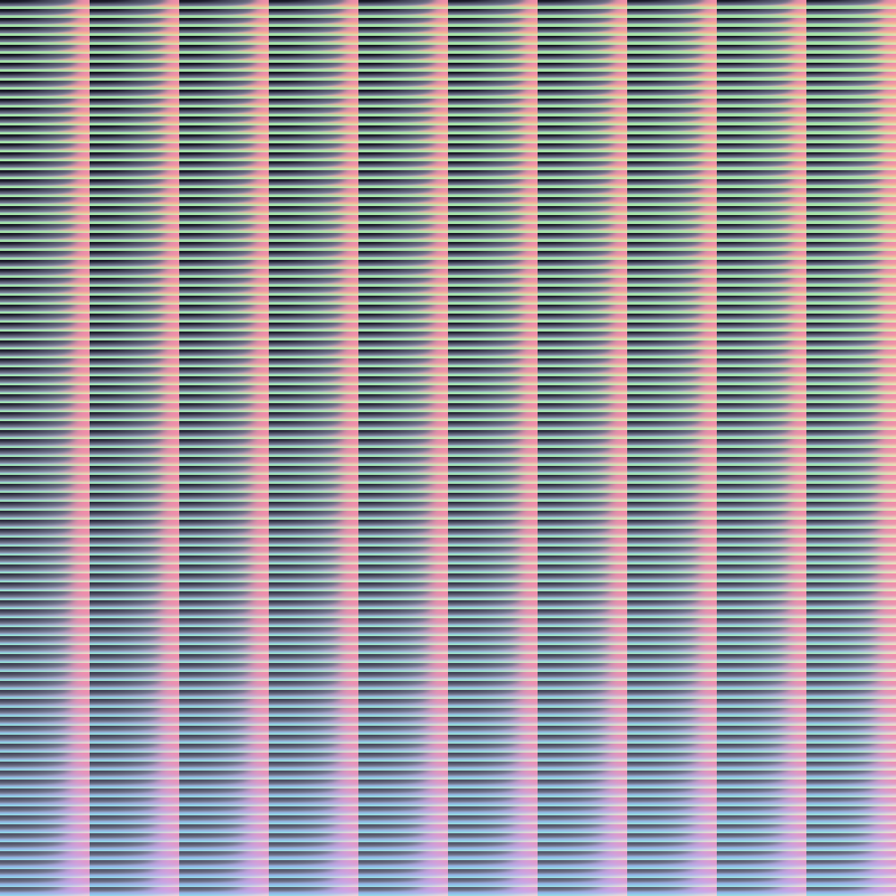
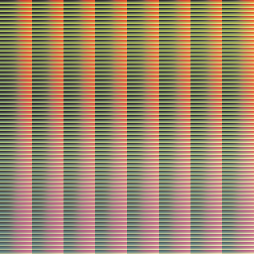
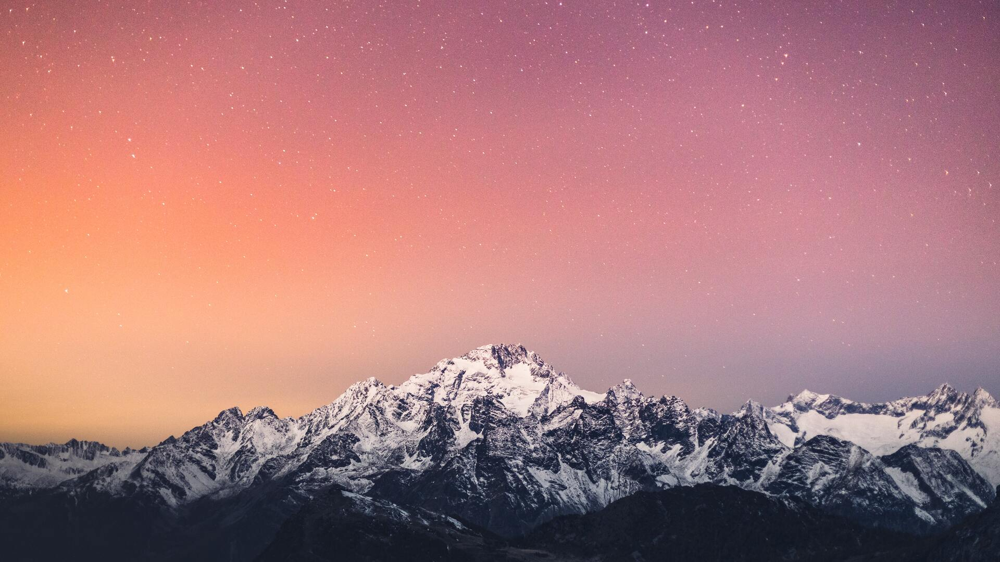
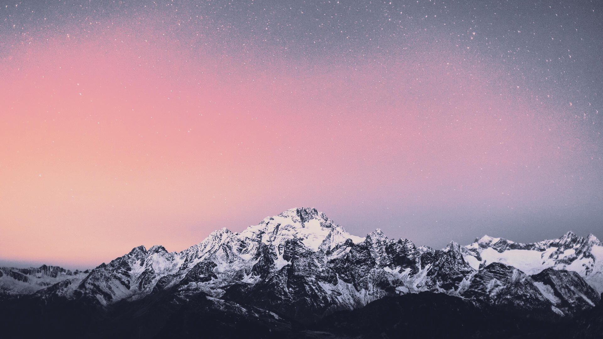
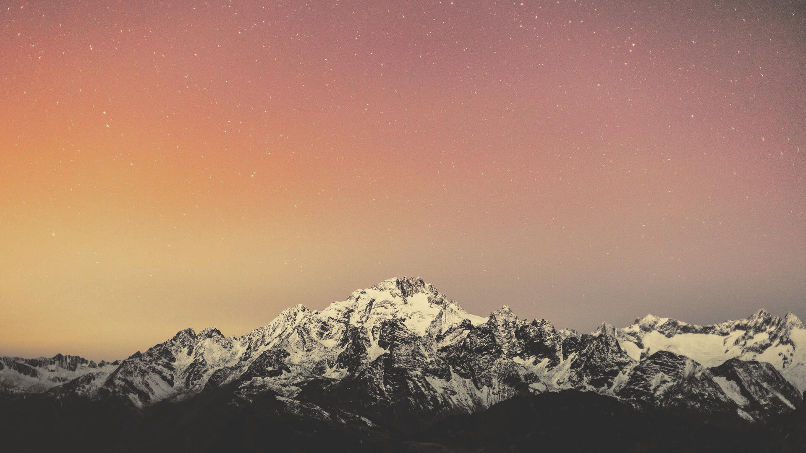

<header>
    <br>
    <div align="center">
        
    </div>
    <h2 align="center">lutgen-rs</h2>
    <p align="center">
        <a href="https://crates.io/crates/lutgen-cli"></a>
        <a href="https://crates.io/crates/lutgen-studio"></a>
        <a href="https://lut.sh"></a>
        <a href="https://github.com/ozwaldorf/lutgen-rs/actions/workflows/release.yml"></a>
        <a href="https://garnix.io"></a>
    </p>
    <p align="center">
        A blazingly fast interpolated <a href="https://en.wikipedia.org/wiki/3D_lookup_table">LUT</a> utility for arbitrary and popular color palettes. Theme any image to your desktop colorscheme!
    </p>
</header>

---

## Example Output

### Hald Cluts

<details>
    <summary>Catppuccin Mocha</summary>
    
</details>
<details>
    <summary>Gruvbox Dark</summary>
    
</details>
<details>
    <summary>Nord</summary>
    
</details>

### Color Corrections

<details>
    <summary>Original Image</summary>
    
</details>
<details>
    <summary>Catppuccin Mocha</summary>
    
</details>
<details>
    <summary>Gruvbox Dark</summary>
    
</details>
<details>
    <summary>Nord</summary>
    
</details>

## Lutgen CLI

### Package Repositories

[](https://repology.org/project/lutgen/versions)

### Install from source

```bash
git clone https://github.com/ozwaldorf/lutgen-rs
cd lutgen-rs
cargo install --path crates/cli
```

### Crates.io

```bash
cargo install lutgen-cli
```

### Documentation

Detailed documentation, examples, and more are available on [The Lutgen Wiki](https://ozwaldorf.github.io/lutgen-rs)

## Lutgen Studio


### Package Repositories

[](https://repology.org/project/lutgen-studio/versions)

### Required Dependencies

(For this example, Ubuntu packages are listed)

- libxcb-render0-dev
- libxcb-shape0-dev
- libxcb-xfixes0-dev
- libxkbcommon-dev
- libssl-dev
- wayland

### Install from source

```bash
git clone https://github.com/ozwaldorf/lutgen-rs
cd lutgen-rs
cargo install --path crates/studio
```

### Crates.io

```bash
cargo install lutgen-studio
```

## Rust Library

See the latest rust documentation on [docs.rs/lutgen](https://docs.rs/lutgen)

## Nix flake

A nix flake is available providing both lutgen and lutgen-studio packages.
The flake can be easily run via:

```bash
nix run github:ozwaldorf/lutgen-rs
nix run github:ozwaldorf/lutgen-rs#lutgen-studio
```

Cache is provided via https://garnix.io

### Development Shell

A development environment is also provided in the flake:

```bash
git clone https://github.com/ozwaldorf/lutgen-rs
cd lutgen-rs
nix develop

# inside dev shell
cargo run -r --bin lutgen
cargo run -r --bin lutgen-studio
```

## Planned features

- [ ] Interpolation for more accuracy when correcting with low level luts (<16)
- [ ] Hardware acceleration for applying luts to images

## Sources

- Hald Cluts: https://www.quelsolaar.com/technology/clut.html
- Editing with Hald Cluts: https://im.snibgo.com/edithald.htm
- Sparse Hald Cluts: https://im.snibgo.com/sphaldcl.htm
- RBF Interpolation: https://en.wikipedia.org/wiki/Radial_basis_function_interpolation
- Shepard's method: https://en.wikipedia.org/wiki/Inverse_distance_weighting
- Oklab Colorspace: https://bottosson.github.io/posts/oklab/

## Special Thanks

- [Gingeh](https://github.com/Gingeh) for the initial inspiration and imagemagick approach
- [The Catppuccin Org](https://github.com/catppuccin) for continual feedback and support along the way
- [Stonks3141](https://github.com/Stonks3141) for maintaining the Alpine Linux package
- All the nixpkgs maintainers

