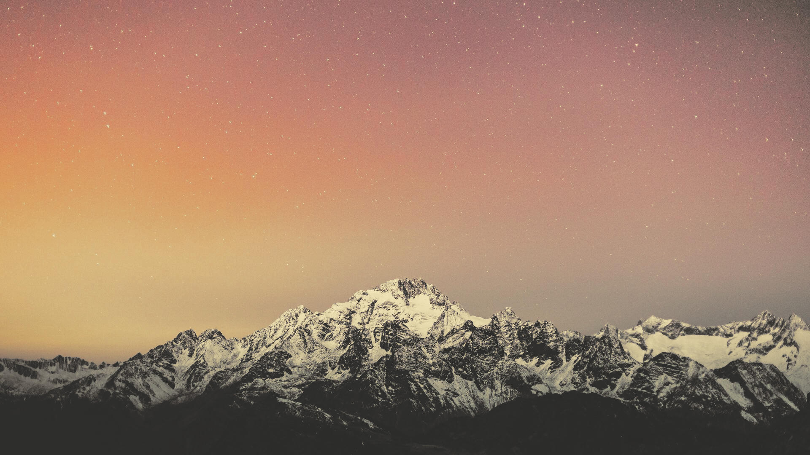

<header>
    <br>
    <div align="center">
        
    </div>
    <h2 align="center">lutgen-rs</h2>
    <p align="center">
        <a href="https://github.com/ozwaldorf/lutgen-rs/releases/latest"></a>
        <a href="./LICENSE.md"></a>
        <a href="https://github.com/ozwaldorf/lutgen-rs/actions/workflows/publish.yml"></a>
        <a href="https://garnix.io"></a>
    </p>
    <p align="center">
        A blazingly fast interpolated <a href="https://en.wikipedia.org/wiki/3D_lookup_table">LUT</a> utility for arbitrary and popular color palettes. Theme any image to your desktop colorscheme!
    </p>
</header>

---

## Example Output

### Hald Cluts

<details>
    <summary>Catppuccin Mocha</summary>
    
</details>
<details>
    <summary>Gruvbox Dark</summary>
    
</details>
<details>
    <summary>Nord</summary>
    
</details>

### Color Corrections

<details>
    <summary>Original Image</summary>
    
</details>
<details>
    <summary>Catppuccin Mocha</summary>
    
</details>
<details>
    <summary>Gruvbox Dark</summary>
    
</details>
<details>
    <summary>Nord</summary>
    
</details>

## CLI

### Installation

[](https://repology.org/project/lutgen/versions)

#### Source

```bash
git clone https://github.com/ozwaldorf/lutgen-rs
cd lutgen-rs
cargo install --path .
```

#### Nix flake

A nix flake is available and can be run easily with:

```bash
nix run github:ozwaldorf/lutgen-rs
```

Cache is provided via https://garnix.io

### Documentation

Detailed cli documentation is available at [docs/README.md](./docs/README.md).

### Examples

Correcting an image

```bash
# Builtin palette
lutgen apply -p catppuccin-mocha docs/example-image.jpg -o mocha_version.jpg

# Custom colors
lutgen apply docs/example-image.jpg -- "#ABCDEF" ffffff 000000

# Custom palette file with whitespace separated hex colors
echo "fff 555 000 abcdef deadbe" > ~/.lutgen/my-palette-name
lutgen apply docs/example-image.jpg -p my-palette-name

# Multiple images
lutgen apply image1.png image2.png *.jpg -p catppuccin-mocha

# Using an external LUT
lutgen apply --hald-clut mocha_lut.png docs/example-image.jpg
```

Generating a standalone LUT for external or manual usage

```bash
# Builtin palette
lutgen generate -p catppuccin-mocha -o mocha_lut.png

# Custom colors
lutgen generate -o custom.png -- "#ABCDEF" ffffff 000000

# Custom palette file with hex codes
lutgen generate -o custom.png -- $(cat palette.txt)
```

Preview palletes

```bash
# Preview all palettes
lutgen palette

# Copy a palette to the custom palette dir for modifying and overriding
lutgen palette carburetor > ~/.lutgen/carburetor

# Finding a palette name with grep
lutgen palette names | grep 'gruvbox'
```

Correcting videos (using ffmpeg):

```bash
ffmpeg -i input.mkv -i hald_clut.png -filter_complex '[0][1] haldclut' output.mp4
```

Dynamic completions:

```bash
# Supports zsh, bash, fish, and elvish
lutgen completions zsh > _lutgen

# Install the completion script
sudo mv _lutgen /usr/local/share/zsh/site-functions/
```

## Library

See the latest documentation on [docs.rs](https://docs.rs/lutgen)

## Planned features

- [ ] Interpolation for more accuracy when correcting with low level luts (<16)
- [ ] Hardware acceleration for applying luts to images

## Sources

- Hald Cluts: https://www.quelsolaar.com/technology/clut.html
- Editing with Hald Cluts: https://im.snibgo.com/edithald.htm
- Sparse Hald Cluts: https://im.snibgo.com/sphaldcl.htm
- RBF Interpolation: https://en.wikipedia.org/wiki/Radial_basis_function_interpolation
- Shepard's method: https://en.wikipedia.org/wiki/Inverse_distance_weighting
- Oklab Colorspace: https://bottosson.github.io/posts/oklab/

## Special Thanks

- [Stonks3141](https://github.com/Stonks3141) for maintaining the Alpine Linux package
- All the nixpkgs maintainers
